# Bigeekie - Node RED, domótica en casa

## Índice:

- Gateway

  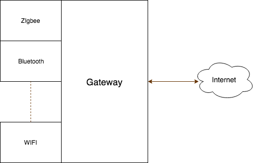
  
  Ejemplos: https://www.google.es/search?q=gateway+domotica

- Instalar node-red

  - https://nodered.org/docs/getting-started/installation
  - https://nodered.org/docs/security
  - Interfaces: MQTT, HTTP, Websockets, TCP, UDP, BLE, GPIO, etc….
  - Muchísimos plugins
  - Finalidad
    - Centralización.
    - Ayuda a dispositivos ligeros al procesamiento.
    - Cacheo en caso de caída de red.
    - Multi interfaz.
    - Conectividad desde el exterior.

- MQTT (Message Queuing Telemetry Transport) https://en.wikipedia.org/wiki/MQTT
  Publish/subscribe. Comunicación bidireccional fácil.

- Sensores MQTT con DeepSleep

  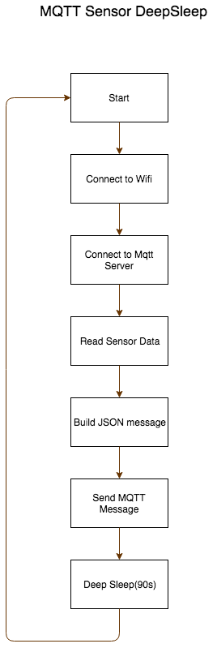

- Actuadores MQTT

  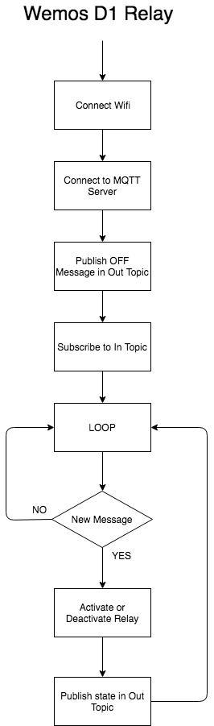

  Programas en la carpeta ArduinoProjects. ESP8266 y ESP32

- TimeSeries Database, Graphic tool and alarm management (InfluxDb, Chronograf, Kapacitor) 
  - https://en.wikipedia.org/wiki/InfluxDB

- Flows

  - ​Escuchar MQTT:
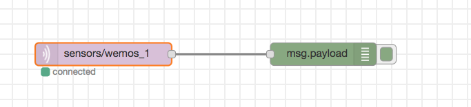
  - Generar Dashboard:
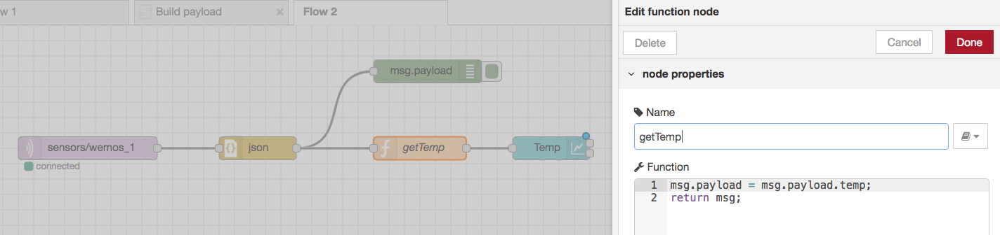
  - Poner un botón en el dashboard:
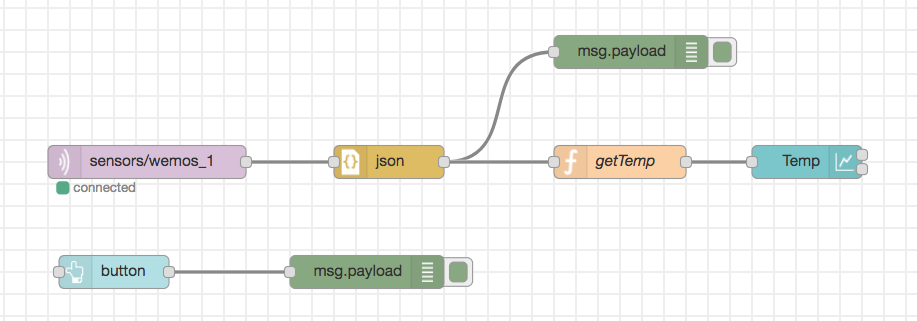
  - Capturar medidas de los sensores y guardarlas en InfluxDb:
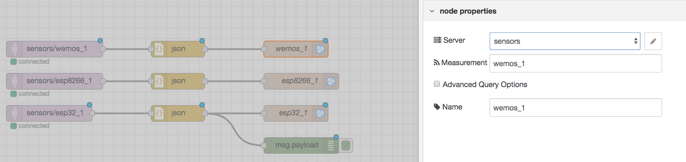
  - Averiguar el chatId de tu conversación con el bot de telegram:
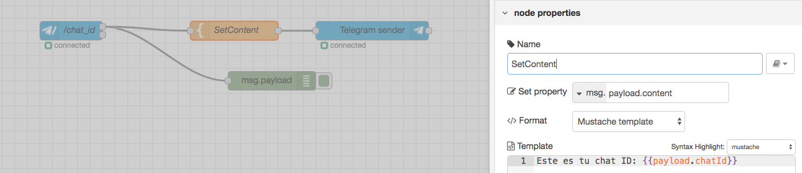
  - Configuración del bot de telegram:
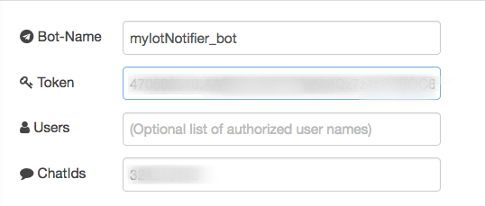
  - Preguntar al bot por las últimas medidas:
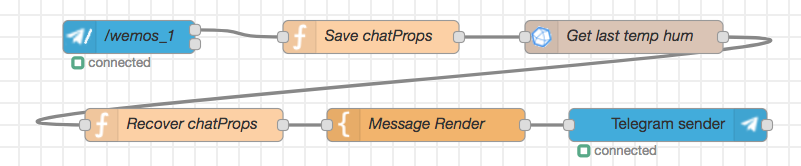
  - Enlazar el botón del dashboard con el bot:
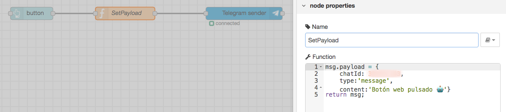
  - Añadir botón de AWS IoT:
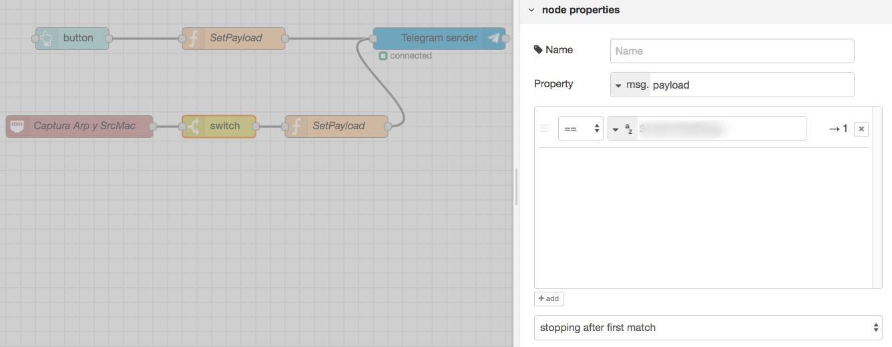
  - Activar y desactivar la TupperLamp:
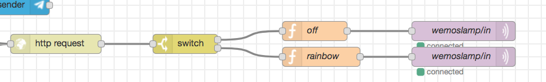
  - Activar relé en base a alarmas de Kapacitor:
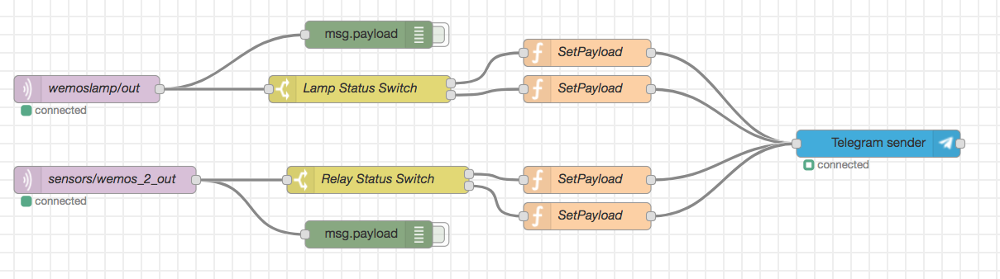
  - Enviar notificación del cambio a Telegram:

- Ejemplo gráficos Chronograf:
  - Gráfico de líneas:
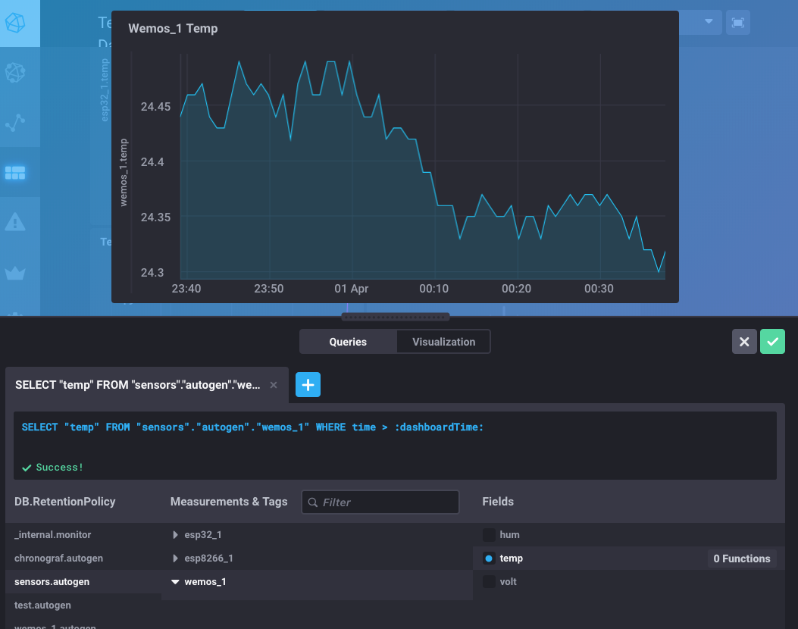
  - Gauge:
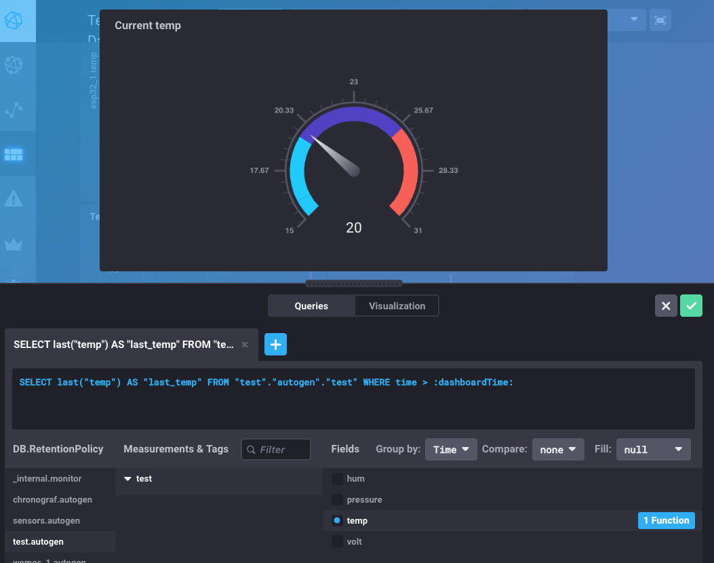

- Ejemplo alertas Kapacitor:
  - Temp alert:
    - Threshold
    - Seleccionar base de datos y medida
    - temp, less than 16
    - add handler: Telegram con bot token y chatId
    - Message: {{ if eq .Level "OK" }}Problema de temperatura arreglado 😀.{{ else }}La temperatura ha bajado de 16ºC 💩.{{ end }} Valor actual:  {{ index .Fields "value" }} ºC, fecha:  {{.Time}}

  - Relay alert:
    - Threshold
    - Seleccionar base de datos y medida
    - temp, less than 16
    - add handler: http://localhost:1880/api/relay
    - Message: {{ if eq .Level "OK" }}OFF{{ else }}ON{{ end }}

## Recetas:
  [Recetas.md](Recetas.md)