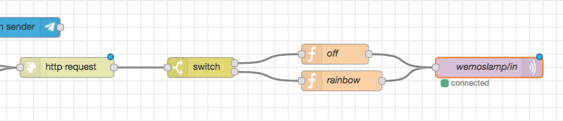

# Activar y desactivar la TupperLamp

## Diagrama de Bloques:


## Detalle de Bloques:
- http request
  - GET http://wemoslamp.local/get_switch
- switch
  - msg.payload
  - 1
  - 0
  - stopping after first match
- Función off:
```js
msg.payload = '=off';
return msg;
```
- Función rainbow:
```js
msg.payload = '=rainbow';
return msg;
```
- Enviar mensaje MQTT al topic ```wemoslamp/in```

