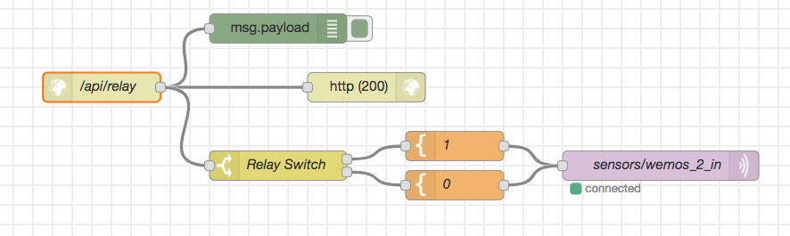

# Activar relé en base a alarmas de Kapacitor

## Diagrama de Bloques:



## Detalle de Bloques:
- http endpoint:
  - POST /api/relay
- http response. status code 200
- Render message tipo template
  - msg.payload
```
{{payload.message}}
```
- Enviar mensaje por MQTT al topic sensors/wemos_2_in

