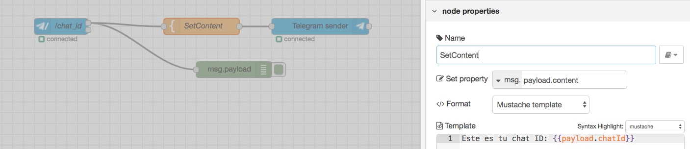

# Averiguar el chatId de tu conversación con el bot de telegram

## Diagrama de Bloques:


## Detalle de Bloques:
- Bloque command Telegram:
  - command: /chat_id

- Bloque Telegram sender

- Bloque SetContent tipo Template:

```Este es tu chat ID: {{payload.chatId}} ```

- Una vez obtenido el chatId, introducirlo en la conexión del telegrambot.