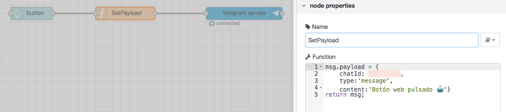

# Enlazar el botón del dashboard con el bot

## Diagrama de Bloques:


## Detalle de Bloques:

- Bloque SetPayload tipo Function:

```js
msg.payload = {
    chatId: {{chatIdHardcoded}},
    type:'message',
    content:'Botón web pulsado 🤖'};
return msg;
```

